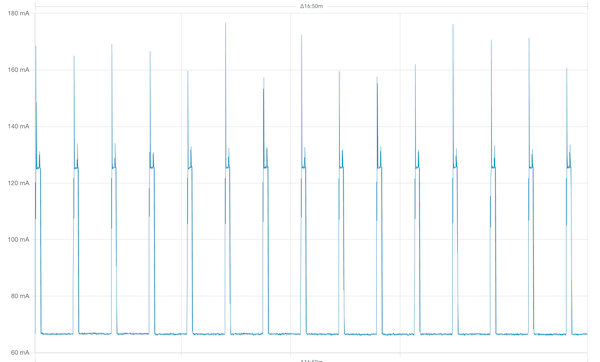

## Priklad pro modul LoRa868 V1.1

* SKU:M029-V11
* [Documentace](https://docs.m5stack.com/en/module/Module-LoRa868_V1.1) 

Modul LoRa868 v1.1 je komunikační modul LoRa (provozní frekvence 868 MHz) ze série M5Stack, 
který využívá modulu Ra-01H od AI-Thinker (čip SX1276). Modul je vybaven vestavěnou anténou SMA a 
navíc poskytuje dvě rozhraní pro připojení antén MCX, což umožňuje volně přepínat mezi různými typy antén. 
Modul je vybaven DIP přepínačem, který umožňuje flexibilně přepínat mezi různými komunikačními piny, 
což dovoluje současné použití více modulů a poskytuje tak více možností přizpůsobení a flexibility.

Modul používá jako komunikační rozhrani SPI. Pro komunikaci s modulem je pouzita knihovna [RadioLib](https://github.com/jgromes/RadioLib)

## Konfigurace

Parametry modulu, ktere mohou byt dulezite pro konfigurovani

```
#define LORA_BW 500.0
#define LORA_SF 7
#define LORA_CR 8

#define LORA_FREQ         868.0
#define LORA_SYNC_WORD    0x34
#define LORA_TX_POWER     22
#define LORA_PREAMBLE_LEN 20

#define CONFIG_MISO_GPIO GPIO_NUM_35
#define CONFIG_MOSI_GPIO GPIO_NUM_37
#define CONFIG_SCLK_GPIO GPIO_NUM_36

#define CONFIG_LORA_NSS  GPIO_NUM_0
#define CONFIG_LORA_BUSY GPIO_NUM_2
#define CONFIG_LORA_RST  GPIO_NUM_7
#define CONFIG_LORA_IRQ  GPIO_NUM_10
```

Parametry NSS, IRQ a RST musi byt nastaveny na DIP prepinacich na desce. Hodnoty `NSS=0, RST=7, IRQ=10` 
pro mne fungovaly OK.

**Dulezite**: radio modul objekt musi byt definovan jako SX1276, objekt SX1278 nefunguje.

```
SX1276 radio = new Module(CONFIG_LORA_NSS, CONFIG_LORA_IRQ, CONFIG_LORA_RST, CONFIG_LORA_BUSY);
```

### Spotreba

Pro LoRaWAN projekty je dulezita spotreba. Bohuzel M5Stack CoreS3SE + LoRa868 V1.1 potrebuji i v deep-sleep mode asi 70mA, pri vysilani je spotreba kratce asi 170mA. To neni
pro prakticke nasazeni akceptovatelne. Zrejme proto M5Stack nenabizi zadne moduly pro napajeni ze solarnich panelu, jako to ma RAK Wireless.



Neni mi jasne, co vse by se jeste dalo vypnout, tech 70mA je opravdu moc.